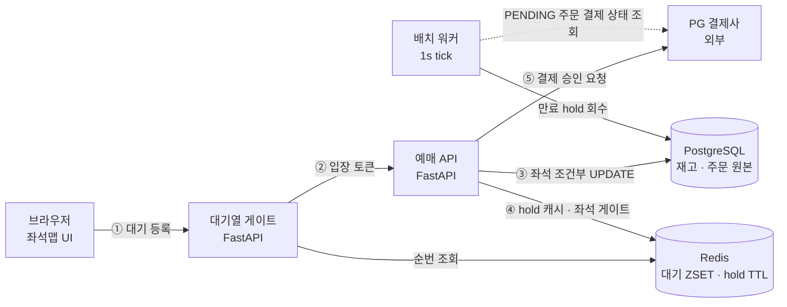
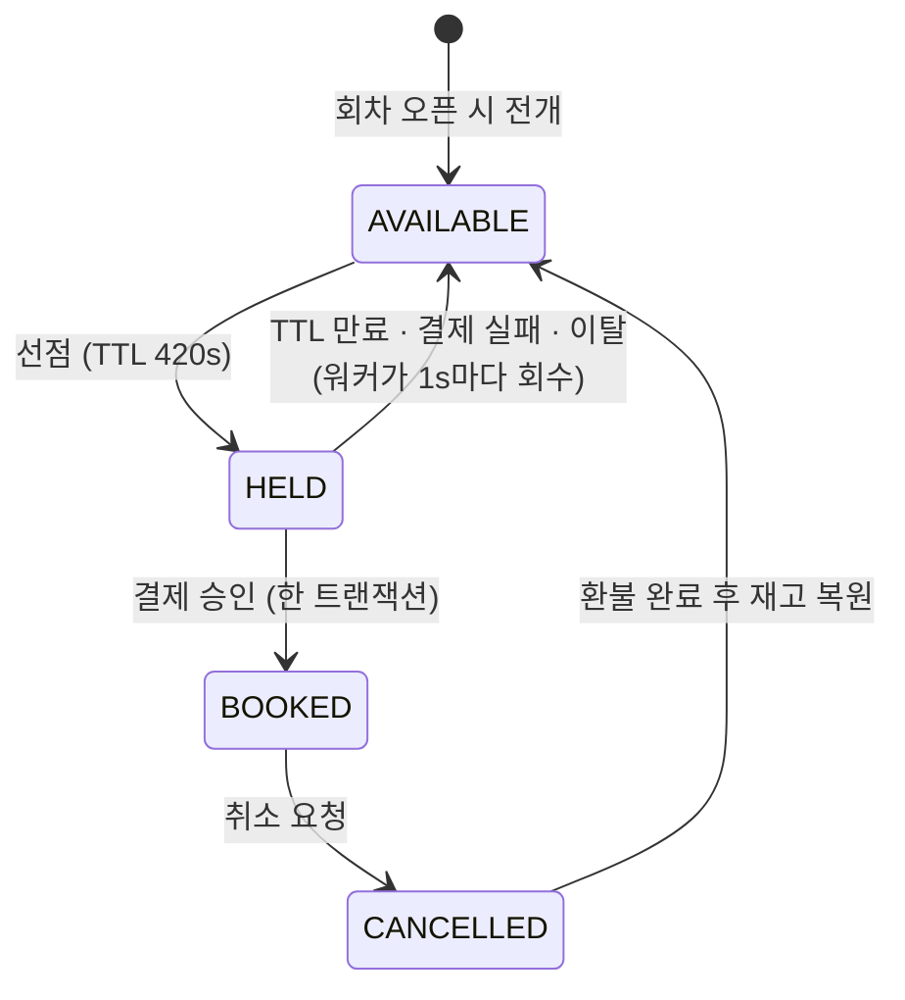
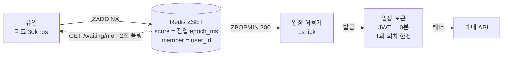
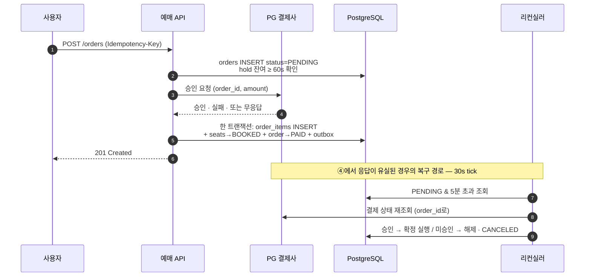

# Curtain 예매 시스템 설계

> 좌석 지정 공연 티켓 예매 백엔드. 설계의 무게는 전부 **같은 좌석을 동시에 노리는 수천 명을
> 어떻게 한 명으로 줄이는가**에 실려 있다.

| | |
|---|---|
| 버전 | v0.1 |
| 작성 | 2026-09-09 |
| 스택 | FastAPI · PostgreSQL 16 · Redis 7 |
| 범위 | 백엔드 API · 배치 워커 |
| 가정 | 1,200석 공연장 · 회차 3개 · 오픈 순간 동시 3만 요청 |

---

## §1 범위와 설계 원칙

토이 프로젝트지만 "돌아가는 예매"가 목표는 아니다. 목표는 *틀린 예매가 구조적으로 불가능한* 예매다.

### 1.1 정책 상수

아래 숫자는 국내 예매 서비스의 실제 관례를 따랐다. 코드에 흩뿌리지 않고 `app/domain/policy.py`
한 곳에 모은다.

| 항목 | 값 |
|---|---|
| 좌석 선점 (hold TTL) | 420초 |
| 1인 구매 한도 | 4매 / 회차 |
| 입장 토큰 유효 | 10분 |
| 대기열 허용 유량 | 200명 / 초 |
| 순번 폴링 간격 | 2초 |
| 결제 대기 상한 | 5분 |
| 결제 요청 최소 hold 잔여 | 60초 |

취소 수수료는 관람일 기준 D-8까지 무료, D-7\~D-3 티켓금액 10%, D-2\~D-1 20%, 관람일 당일 취소 불가.

### 1.2 네 가지 원칙

**01. 정합성의 단일 진실은 PostgreSQL이다.**
Redis는 전부 최적화 계층이다. Redis를 통째로 날려도 오버부킹은 발생하지 않아야 하고,
그게 이 설계의 합격 기준이다 (§10 참조).

**02. 부분 성공은 없다.**
4석 요청은 4석 전부이거나 0석이다. "3석은 잡았는데 1석이 방금 팔렸어요"는 사용자에게
최악의 응답이고, 재고 상태로도 쓰레기를 남긴다.

**03. 모든 상태 전이는 조건부 쓰기로만 한다.**
`WHERE status = 기대값` 없는 `UPDATE`는 리뷰에서 거절한다. 읽고-판단하고-쓰는 3단계는
그 사이에 남이 끼어든다.

**04. 외부 호출은 리컨실러가 뒤를 받친다.**
결제가 "실패한 것"과 결제 "응답을 못 받은 것"은 완전히 다른 사건이다. 후자를 전자로
취급하면 돈은 빠져나갔는데 좌석이 없는 사고가 난다.

### 1.3 다루는 것 / 다루지 않는 것

| 다룬다 | 다루지 않는다 (§11) |
|---|---|
| 좌석맵 조회 · 좌석 선점 · 예매 확정 · 취소 | QR 티켓 발급과 입장 검증 |
| 대기열 입장 제어 | 매크로 · 부정 예매 탐지 |
| 결제 사가와 실패 보상 | 실제 PG 연동 (Fake 어댑터로 대체) |
| 재고 정합성 검증 테스트 | 좌석 자동 배정 · 동적 가격 |

---

## §2 시스템 구성

프로세스는 세 종류다. 대기열을 지키는 게이트, 예매를 처리하는 API, 그리고 아무도 안 볼 때
뒷정리를 하는 워커.



정합성이 걸린 경로는 ③ 하나뿐이고, 나머지는 전부 그 경로에 도달하는 요청 수를 줄이거나
뒤늦게 청소하는 역할이다.

### 2.1 배치 워커

| 워커 | 주기 | 역할 |
|---|---|---|
| `hold_sweeper` | 1s | 만료된 `HELD` 좌석을 `AVAILABLE`로 회수. 클라이언트가 브라우저를 닫아버린 경우의 유일한 회수 수단 |
| `queue_admitter` | 1s | 대기열에서 200명을 꺼내 입장 토큰 발급 |
| `order_reconciler` | 30s | `PENDING`으로 5분 넘은 주문을 PG사에 되물어 확정 또는 취소. 원칙 04의 구현체 |
| `outbox_publisher` | 1s | `outbox` 테이블을 폴링해 알림/영수증 발행 |

### 2.2 장애 방향은 반대로 잡는다

- **Redis 장애 시 좌석 게이트는 fail-open.** 우회해도 PostgreSQL이 막아주므로 지연만 늘어난다.
- **Redis 장애 시 대기열은 fail-closed.** 게이트가 열리면 3만 rps가 예매 API를 직격하므로
  `503` + 재시도 안내가 낫다.

같은 Redis 장애인데 대응이 반대인 이유는 하나가 정합성 밖에 있고 하나가 부하 방벽이기 때문이다.

---

## §3 재고 모델과 스키마

예매 시스템의 재고는 "남은 수량"이 아니라 "특정 회차의 특정 좌석"이다. 이 차이가 스키마 전체를
결정한다.

```
schedules (3 회차)          seats (1,200석, 공연장 고정)
  09/26 (금) 19:30            VIP  120석
  09/27 (토) 14:00      ×     R    380석      ──▶  schedule_seats  3,600행
  09/27 (토) 19:00            S    700석           UNIQUE (schedule_id, seat_id)
                                                    status: AVAILABLE | HELD | BOOKED
```

한 좌석 = 정확히 한 행. "재고 수량" 컬럼이 없으므로 감산 경쟁도 없다. 오버부킹은 "숫자를
잘못 뺀 버그"가 아니라 **유니크 제약 위반**이 되어 DB가 거절한다.

스키마의 단일 원천은 [`app/infra/db/models.py`](../app/infra/db/models.py)이고, DDL은
Alembic 이 그 모델에서 생성한다 ([`migrations/versions/`](../migrations/versions/)).
부분 인덱스·커버링 인덱스·CHECK 는 모델에서 그대로 표현되지만 ENUM 은 수동 보정이
필요하다 — 이유와 검증 결과는 [ADR 0002](adr/0002-migrations.md)에 있다.
아래는 생성되는 DDL 중 핵심만 옮긴 것이다.

```sql
CREATE TYPE seat_status AS ENUM ('AVAILABLE', 'HELD', 'BOOKED');

CREATE TABLE schedule_seats (
  id               bigserial   PRIMARY KEY,
  schedule_id      bigint      NOT NULL REFERENCES schedules(id),
  seat_id          bigint      NOT NULL REFERENCES seats(id),
  grade            text        NOT NULL,          -- VIP / R / S
  price            integer     NOT NULL,
  status           seat_status NOT NULL DEFAULT 'AVAILABLE',
  held_by          bigint      REFERENCES users(id),
  hold_expires_at  timestamptz,
  updated_at       timestamptz NOT NULL DEFAULT now(),

  -- 오버부킹의 1차 방어선: 같은 회차에 같은 좌석은 한 행만 존재한다.
  CONSTRAINT uq_schedule_seat UNIQUE (schedule_id, seat_id),

  -- HELD 상태와 hold 메타데이터가 어긋난 행은 DB가 애초에 받지 않는다.
  CONSTRAINT ck_schedule_seats_hold_shape CHECK (
       (status =  'HELD' AND held_by IS NOT NULL AND hold_expires_at IS NOT NULL)
    OR (status <> 'HELD' AND held_by IS NULL     AND hold_expires_at IS NULL)
  )
);

-- 좌석맵은 회차 단위 1,200행 전량 조회다. INCLUDE로 힙 접근을 없앤다.
CREATE INDEX ix_seatmap ON schedule_seats (schedule_id)
  INCLUDE (seat_id, grade, price, status);

-- 만료 스윕이 훑는 대상은 선점분뿐이다. 부분 인덱스로 스캔량을 재고 전체에서
-- 동시 선점 좌석 수(수백 행)로 줄인다.
CREATE INDEX ix_hold_expiry ON schedule_seats (hold_expires_at)
  WHERE status = 'HELD';

-- 이중 판매의 최종 방어선. 한 재고 행은 평생 한 주문 항목에만 붙는다.
CREATE TABLE order_items (
  id                bigserial PRIMARY KEY,
  order_id          bigint    NOT NULL REFERENCES orders(id),
  schedule_seat_id  bigint    NOT NULL UNIQUE REFERENCES schedule_seats(id),
  price             integer   NOT NULL
);
```

### 3.1 나머지 테이블의 설계 판단

- `orders.idempotency_key`에 `UNIQUE`. 같은 키로 다섯 번 눌러도 주문은 하나다 (§7).
- `payments`는 주문당 여러 행 가능. 실패한 승인 시도도 기록으로 남긴다 — 정산 분쟁의 유일한 근거다.
- `outbox`는 확정 트랜잭션 안에서 같이 커밋한다. "좌석은 잡혔는데 알림톡이 안 갔다"를 방지한다.
- `schedule_seats`에 `order_item_id` 역참조 컬럼은 **두지 않는다.**
  `order_items.schedule_seat_id UNIQUE`만으로 충분하고, 양방향 FK는 순환 참조와
  삽입 순서 문제만 만든다.

---

## §4 좌석 상태 전이

상태는 셋뿐이다. 중요한 건 상태의 개수가 아니라 *돌아오는 화살표*다 — 시스템이 죽어도 좌석은
결국 팔릴 수 있는 상태로 복귀해야 한다.



`HELD`는 유일하게 시간이 지나면 *스스로 무너지는* 상태다. 그래서 정상 경로(결제 승인)와
비정상 경로(만료·이탈)가 같은 목적지로 수렴하고, 어떤 클라이언트 사고도 좌석을 영구히
잠글 수 없다.

| 전이 | 트리거 | 조건 | 실패 시 응답 |
|---|---|---|---|
| `AVAILABLE` → `HELD` | `POST /holds` | 요청 좌석 **전량**이 가용 · 회차당 보유 ≤ 4매 | `409 SEAT_TAKEN` |
| `HELD` → `BOOKED` | PG 승인 성공 | `held_by` 일치 · `hold_expires_at > now()` | `409 HOLD_EXPIRED` + 자동 환불 |
| `HELD` → `AVAILABLE` | 워커 / `DELETE /holds` | 만료됨, 또는 본인 해제 | — |
| `BOOKED` → `CANCELLED` | `POST /orders/{id}/cancel` | 관람일 D-1 이전 | `422 CANCEL_CLOSED` |
| `CANCELLED` → `AVAILABLE` | 환불 확인 워커 | PG 환불 완료 응답 | 재시도 (재고 복원 지연 허용) |

> **왜 `HELD` → `BOOKED` 실패에 환불이 붙나**
> 결제는 승인됐는데 그 순간 hold가 만료돼 있는 창(window)이 실존한다. PG 승인 왕복이 hold
> 잔여 시간보다 길어지면 발생한다. 그래서 `POST /orders`는 **hold 잔여가 60초 미만이면
> 승인 요청 자체를 거절**하고, 그래도 뚫린 경우엔 즉시 자동 환불 + 명시적 실패 응답을 준다.
> 이 창을 없애려 하지 말고 좁히고 감지하는 쪽을 택했다.

---

## §5 동시성 전략

문제를 정확히 쓰면: 오픈 순간 인기 좌석 한 석에 수백 개 요청이 동시에 도착한다. 정확히
하나만 성공시키면서, 나머지 수백 개가 DB를 마비시키지 않아야 한다.

### 5.1 먼저: DB만으로도 정확하다

정합성 자체는 조건부 `UPDATE` 하나로 끝난다. Redis는 정확성을 위해 필요한 게 아니라
**DB에 도달하는 경합 건수를 줄이기 위해** 필요하다. 두 역할을 섞으면 "Redis가 죽으면
오버부킹이 나는" 설계가 되고, 그건 원칙 01 위반이다.

```
A. 조건부 UPDATE 단독              B. Redis 좌석 게이트 + 조건부 UPDATE

요청 ─┐                            요청 ─┐
요청 ─┼──▶ PostgreSQL              요청 ─┼──▶ Redis ──1건──▶ PostgreSQL
요청 ─┘     행 잠금 대기열          요청 ─┘    SET NX PX        행 잠금 1건
 ×800                               ×800
                                    탈락 799건 → 즉시 409
800건 전부 같은 행에서 대기          DB에 도달하지 않는다
→ 커넥션 풀 고갈, p99 급증
결과는 맞다. 서비스가 죽는다.        Redis가 죽어도 여기서 다시 걸러진다
```

B안이 더하는 것은 Redis 홉 하나이고, 없애는 것은 DB로 향하는 799개의 화살표다. 두 안의
*결과*는 같다 — 달라지는 것은 그 결과에 도달하기까지 DB가 견뎌야 하는 경합량이다.

### 5.2 선점: 4석 원자 획득

가장 까다로운 요구는 원칙 02다. 4석을 요청했으면 4석 전부여야 한다. 단일 SQL로 처리하면
왕복도 한 번이고, "확인 후 갱신" 사이의 틈도 사라진다.

```sql
WITH target AS (
  SELECT id
    FROM schedule_seats
   WHERE schedule_id = :sid
     AND seat_id = ANY(:seat_ids)              -- 최대 4개
     AND (status = 'AVAILABLE'
          OR (status = 'HELD' AND hold_expires_at < now()))  -- 만료분 즉시 회수
   ORDER BY seat_id                            -- 잠금 순서 고정 = 데드락 회피
     FOR UPDATE
),
guard AS (                                     -- 전량 확보 여부를 SQL 안에서 판정
  SELECT count(*) = cardinality(:seat_ids::bigint[]) AS ok FROM target
)
UPDATE schedule_seats s
   SET status          = 'HELD',
       held_by         = :user_id,
       hold_expires_at = now() + interval '420 seconds',
       updated_at      = now()
  FROM guard
 WHERE s.id IN (SELECT id FROM target)
   AND guard.ok                                -- 하나라도 모자라면 0행
RETURNING s.seat_id, s.price, s.hold_expires_at;
```

반환 행 수가 0이면 그대로 `409`다. 애플리케이션에는 분기가 없고, 부분 성공이 발생할 수 있는
코드 경로 자체가 존재하지 않는다.

> **검증할 것**
> CTE 안의 `ORDER BY … FOR UPDATE`가 실제로 그 순서대로 잠근다는 보장은 실행 계획에 달려
> 있다. 이 부분은 문서를 믿지 말고 `tests/test_concurrency.py`에서 교차 좌석 조합(A+B와
> B+A를 동시에)으로 데드락 발생 여부를 직접 확인한다. 계획이 어긋나면
> `SELECT … FOR UPDATE`를 별도 문장으로 분리한다.

### 5.3 Redis 좌석 게이트

DB 앞단의 문지기. 4석 중 일부만 잡히는 상황이 여기서도 생기므로 Lua로 원자화한다. 키에
`{schedule_id}` 해시 태그를 넣어 클러스터에서도 같은 슬롯에 떨어지게 한다.
구현: [`app/infra/redis/lua/seat_gate.lua`](../app/infra/redis/lua/seat_gate.lua)

게이트 TTL은 hold TTL보다 **짧게**(430초 vs 420초 + 여유) 준다. 게이트가 DB보다 오래 남으면
DB에서는 이미 풀린 좌석이 Redis 때문에 계속 막히는, 진단하기 고약한 유령 매진이 생긴다.
진실이 DB에 있으므로 캐시가 먼저 사라져야 한다.

### 5.4 hold 만료 스윕

```sql
UPDATE schedule_seats
   SET status = 'AVAILABLE', held_by = NULL, hold_expires_at = NULL,
       updated_at = now()
 WHERE id IN (
   SELECT id FROM schedule_seats
    WHERE status = 'HELD' AND hold_expires_at < now()
    ORDER BY hold_expires_at
    LIMIT 500                     -- 한 tick에 처리할 상한. 긴 트랜잭션 방지
      FOR UPDATE SKIP LOCKED      -- 워커 N대가 서로 기다리지 않는다
 )
RETURNING schedule_id, seat_id;   -- 좌석맵 캐시 무효화 대상
```

`SKIP LOCKED` 덕분에 워커를 몇 대 띄워도 서로 블록되지 않는다. 스윕은 *부하 분산 가능한*
작업이고, 이게 만료 처리를 DB 트리거나 `pg_cron`이 아니라 애플리케이션 워커에 둔 이유다.

### 5.5 좌석맵 조회 부하

선점보다 요청 수가 압도적으로 많은 건 좌석맵 조회다(1,200행 × 초당 수천). 매번 DB를 때리면
선점 트랜잭션이 쓸 커넥션이 남지 않는다.

- 회차별 좌석 상태를 Redis 해시에 캐시, **TTL 3초**. 개별 좌석 변경 시 정교하게 무효화하지
  않고 짧은 TTL로 수렴시킨다 — 무효화 로직이 없으면 무효화 버그도 없다.
- 3초의 stale은 **의도적으로 수용**한다. 좌석맵은 힌트고, 진짜 판정은 선점 API가 한다.
  UI는 "이미 선택된 좌석입니다" 응답을 정상 흐름으로 처리한다.
- 응답에 `ETag`를 붙여 변화 없는 회차는 `304`로 끊는다. 오픈 5분 후부터는 대부분의 회차가
  여기 해당한다.

### 5.6 hold을 어디에 두나 — 결정 기록

| 안 | 장점 | 대가 | 판정 |
|---|---|---|---|
| Postgres 행에만 | 진실이 한 곳. 재시작·장애에 무관하게 정확 | 모든 경합이 DB 행 잠금까지 내려온다 | 기준선 (정합성 담당) |
| Redis에만 | 가장 빠르고 TTL이 공짜 | Redis 유실 = 오버부킹. 원칙 01 위반 | **기각** |
| Redis 게이트 + Postgres 원본 | DB 경합을 수백 → 1건으로. 게이트 유실은 지연만 유발 | 이중 기록. TTL 순서를 틀리면 유령 매진 | **채택** |

---

## §6 대기열과 트래픽 제어

티켓팅 시스템이 죽는 지점은 예매가 아니라 오픈 직후 60초다. 대기열의 목적은 공정한 순서가
아니라 *유량을 예매 API가 견딜 수 있는 값으로 고정하는 것*이다.



유입은 통제 불가지만 `ZPOPMIN` 배치 크기는 통제 가능하다. 예매 API가 보는 부하는 유입량과
무관하게 항상 200 rps 근처로 고정된다. 200/s는 예매 API 실측 처리량에서 역산한 값이고,
부하 테스트 결과에 따라 조이거나 푼다.

```
# 대기 등록 — NX로 새로고침 어뷰징(순번 리셋) 방지
ZADD    wq:{sched_id}  NX  <진입 epoch_ms>  <user_id>

# 내 순번 (0-based) + 앞에 남은 인원
ZRANK   wq:{sched_id}  <user_id>
ZCARD   wq:{sched_id}

# 입장 허용기: 1초마다 앞에서 200명, 원자적으로 꺼낸다
ZPOPMIN wq:{sched_id}  200
SETEX   entry:{sched_id}:<user_id>  600  1     # 토큰 유효 10분

# 이탈 감지: 폴링이 15초 이상 끊긴 대기자는 줄에서 빼 앞을 당긴다
ZADD    wq:hb:{sched_id}  <now_ms>  <user_id>  # 폴링마다 갱신
ZRANGEBYSCORE wq:hb:{sched_id}  -inf  <now_ms - 15000>
```

예상 대기 시간은 `ZRANK ÷ 200`초. 정확할 필요는 없지만 **단조 감소해야 한다** — 남은 시간이
늘어나는 화면이 새로고침 폭풍을 만든다. 그래서 서버는 계산값을 그대로 주지 않고 이전에 보낸
값보다 크면 이전 값을 유지해서 응답한다.

### 6.1 대기열 밖의 방어선

- **회차 단위 대기열.** 전역 큐 하나는 인기 없는 회차 구매자까지 볼모로 잡는다.
- **레이트 리밋.** `POST /holds`는 사용자당 초당 2회. 좌석맵은 IP당 초당 10회.
- **오픈 전 요청은 큐에 넣지 않는다.** `sale_opens_at` 이전에는 `425 Too Early` + 서버 시각을
  응답한다. 클라이언트가 서버 시계에 맞춰 정확히 오픈 시각에 진입하게 만드는 게 사전 폭주보다 낫다.
- **좌석맵은 CDN 앞단 3초 캐시.** 오픈 직전 새로고침 트래픽의 대부분이 여기서 흡수된다.

---

## §7 결제 사가와 보상

여기서 나는 사고만 실제 돈이 걸린 사고다. 설계의 전제는 하나다 — **PG 응답은 반드시 유실된다.**



①–⑥이 정상 경로, ⑦–⑨가 보상 경로다. 핵심은 ⑨의 *분기*다 — 응답을 못 받았다는 사실만으로
취소하지 않고, 반드시 PG사에 되물어 실제 승인 여부를 확인한 뒤 결정한다.

### 7.1 확정 트랜잭션

```sql
BEGIN;

-- 조건부 전이. 0행이면 이미 다른 경로(리컨실러/재시도)가 처리했다는 뜻이므로
-- 에러가 아니라 정상 종료다. 이게 멱등성의 핵심 한 줄.
UPDATE orders SET status = 'PAID', paid_at = now()
 WHERE id = :order_id AND status = 'PENDING';

-- schedule_seat_id UNIQUE 위반(23505)이면 다른 사람이 이미 산 좌석 →
-- 롤백 후 자동 환불 + 409. 애플리케이션 판단이 아니라 DB 제약이 잡아낸다.
INSERT INTO order_items (order_id, schedule_seat_id, price)
SELECT :order_id, id, price
  FROM schedule_seats
 WHERE schedule_id = :sid
   AND seat_id = ANY(:seat_ids)
   AND status = 'HELD'
   AND held_by = :user_id
   AND hold_expires_at > now();          -- 만료된 hold로는 확정 불가

UPDATE schedule_seats
   SET status = 'BOOKED', held_by = NULL, hold_expires_at = NULL
 WHERE id IN (SELECT schedule_seat_id FROM order_items WHERE order_id = :order_id);

-- 알림/영수증 발행을 같은 트랜잭션에 싣는다(outbox 패턴).
-- 예매는 됐는데 알림톡만 안 가는 상태가 원천적으로 생기지 않는다.
INSERT INTO outbox (topic, payload)
VALUES ('order.paid', jsonb_build_object('order_id', :order_id));

COMMIT;
```

삽입된 `order_items` 행 수가 요청 좌석 수와 다르면 커밋 전에 롤백한다. 원칙 02는 확정
단계에서도 그대로 적용된다.

### 7.2 멱등성 세 겹

| 겹 | 장치 | 막는 사고 |
|---|---|---|
| HTTP | `Idempotency-Key` 헤더 → `orders.idempotency_key UNIQUE`. 중복 요청은 저장된 응답을 재생 | 결제 버튼 연타 · 클라이언트 자동 재시도 |
| 사가 | 모든 전이가 `WHERE status = 기대값`. 두 번째 실행은 0행 갱신 후 조용히 성공 | 리컨실러와 콜백이 동시에 같은 주문을 확정 |
| DB | `order_items.schedule_seat_id UNIQUE`. 최후 방어선 | 위 두 겹이 다 뚫렸을 때의 이중 판매 |

PG 웹훅도 같은 규칙을 따른다. 서명 검증 → `pg_tid` 기준 중복 판정 → 확정 트랜잭션 재사용.
웹훅과 동기 응답과 리컨실러가 **모두 같은 함수 하나(`order_service.confirm_paid()`)를 호출**하게
만드는 것이 이 설계에서 가장 중요한 리팩터링이다. 확정 경로가 셋으로 갈라지면 셋 다 미묘하게
다르게 틀린다.

### 7.3 취소와 환불

취소는 즉시 `CANCELLED`로 전이하고 좌석 복원은 **환불 성공 확인 후**에 한다. 순서를 뒤집으면
환불이 실패했는데 좌석은 이미 남에게 팔려 되돌릴 수 없다. 수수료는 `app/domain/policy.py`의
순수 함수로 계산하고, 계산 결과를 `payments`에 스냅샷으로 남긴다 — 정책이 바뀌어도 과거
취소 내역의 근거가 흔들리지 않게.

---

## §8 API 스펙

엔드포인트 11개. HTTP 계층은 인증·검증·직렬화만 하고 판단은 전부 서비스 계층에 있다.

| 메서드 · 경로 | 동작 | 요구 헤더 | 주요 응답 |
|---|---|---|---|
| `GET /performances` | 공연 목록 (판매 중 · 오픈 예정) | — | `200` |
| `GET /performances/{id}/schedules` | 회차 목록 · 잔여석 요약 | — | `200` |
| `GET /schedules/{id}/seatmap` | 좌석 1,200건 상태 일괄. 3초 캐시 + ETag | — | `200` `304` |
| `POST /schedules/{id}/waiting` | 대기열 등록 → `{position, eta_sec}` | Bearer | `202` `425` |
| `GET /schedules/{id}/waiting/me` | 순번 폴링 (2초 간격). 입장 시 토큰 동봉 | Bearer | `200` |
| `POST /schedules/{id}/holds` | **좌석 선점.** 최대 4석, 전량 아니면 실패 | Bearer · X-Entry-Token | `201` `409` `403` |
| `DELETE /holds/{id}` | 선점 해제 (좌석 변경 시) | Bearer | `204` |
| `POST /orders` | **주문 + 결제 승인.** 사가 시작점 | Bearer · Idempotency-Key | `201` `409` `402` |
| `GET /orders/{id}` | 주문 상세 · 사가 진행 상태 | Bearer | `200` |
| `POST /orders/{id}/cancel` | 취소. 수수료 계산 후 환불 요청 | Bearer · Idempotency-Key | `200` `422` |
| `POST /webhooks/pg` | PG 콜백. 서명 검증 + 멱등 처리 | X-PG-Signature | `200` (항상) |

### 8.1 좌석 선점 요청과 실패 응답

```http
POST /schedules/8812/holds
Authorization: Bearer <jwt>
X-Entry-Token: <entry_jwt>

{ "seat_ids": [4051, 4052, 4053, 4054] }
```

```jsonc
// 201 Created
{
  "hold_id": "h_01J8...",
  "expires_at": "2026-09-09T20:14:32+09:00",
  "seats": [
    { "seat_id": 4051, "label": "1층 C열 12번", "grade": "VIP", "price": 170000 }
  ],
  "total_amount": 680000,
  "booking_fee": 8000
}
```

```jsonc
// 409 Conflict — 부분 성공을 주지 않는다
{
  "code": "SEAT_TAKEN",
  "message": "선택한 좌석 중 일부가 이미 예매되었습니다.",
  "unavailable_seat_ids": [4053],
  "hint": "좌석맵을 새로 불러온 뒤 다시 선택해 주세요."
}
```

실패 응답에 `unavailable_seat_ids`를 담는 이유: 클라이언트가 좌석맵 전체를 다시 받지 않고
그 좌석만 회색으로 칠하면서 사용자의 나머지 선택을 유지할 수 있다. 오픈런 상황에서 이 한
필드가 재선택 시간을 크게 줄인다.

---

## §9 코드 구조와 일정

계층은 넷. 규칙은 하나 — `app/domain/`은 DB도 Redis도 HTTP도 모른다. 그래야 상태 전이
규칙을 순수 함수로 테스트할 수 있다.

```
curtain/
├─ app/
│  ├─ api/            # HTTP 경계. 검증·직렬화만. 비즈니스 판단 금지
│  ├─ domain/         # 순수 파이썬. import 가능한 것은 표준 라이브러리뿐
│  │  ├─ seat.py      #   상태 전이 허용 여부 (§4 표가 그대로 코드)
│  │  ├─ order.py     #   사가 상태 기계
│  │  └─ policy.py    #   정책 상수 · 취소 수수료 계산
│  ├─ service/        # 유스케이스 조립. 트랜잭션 경계가 여기 있다
│  ├─ infra/          # db · redis · pg 어댑터 (FakePG 포함)
│  └─ worker/         # hold_sweeper · queue_admitter · order_reconciler · outbox_publisher
├─ migrations/        # Alembic. env.py + versions/
├─ tests/             # test_seat_domain · test_concurrency · test_saga
└─ load/              # locustfile.py
```

### 9.1 마일스톤

| 주차 | 산출물 | 내용 |
|---|---|---|
| 1주차 | **재고 골격** | DDL · 회차 오픈 시 좌석 전개 · 좌석맵 조회 + ETag 캐시. 도메인 단위 테스트로 §4 표를 코드로 고정 |
| 2주차 | **선점과 회수** | 조건부 UPDATE · Redis 게이트 · hold_sweeper. 이 주의 산출물은 기능이 아니라 *동시성 테스트 통과 로그*다 |
| 3주차 | **결제 사가** | FakePG · 확정 트랜잭션 · 리컨실러 · 멱등 3겹 · outbox. 타임아웃과 중복 콜백을 의도적으로 주입해 통과시킨다 |
| 4주차 | **대기열과 부하** | ZSET 큐 · 입장 허용기 · locust 시나리오. 200/s 밸브 값을 실측으로 확정하고 §10을 전부 돌린다 |

---

## §10 검증 시나리오

이 프로젝트의 진짜 산출물은 API가 아니라 이 표다. 여기 전부 통과하면 설계가 맞았다는 뜻이고,
하나라도 실패하면 위의 어느 문단이 거짓말이라는 뜻이다.

| 시나리오 | 방법 | 합격 기준 |
|---|---|---|
| **단일 좌석 경합** | 같은 좌석 1석에 동시 200 요청 | `201` 정확히 1건, 나머지 전부 `409`. DB에 해당 좌석 `HELD` 행 1개 |
| **부분 성공 금지** | 4석 요청 중 1석을 다른 유저가 0.1초 먼저 선점 | 요청 전체 실패. 나머지 3석은 `AVAILABLE` 유지 (쓰레기 hold 0건) |
| **교차 좌석 데드락** | `[A,B]`와 `[B,A]`를 동시에 500회 | 데드락 0건. 발생하면 §5.2의 잠금 순서 가정이 깨진 것 |
| **hold 만료 회수** | 선점 후 클라이언트 프로세스 강제 종료 | 421초 안에 `AVAILABLE` 복귀 후 다른 유저가 구매 성공 |
| **PG 타임아웃** | FakePG에 30초 지연 주입, 실제로는 승인 처리 | 사용자는 실패 응답. 리컨실러가 승인을 발견해 **확정**. 좌석 1건, 결제 1건 |
| **PG 무응답 + 미승인** | FakePG 타임아웃 후 미승인 상태 유지 | 주문 `CANCELED`, 좌석 `AVAILABLE` 복원, 결제 0건 |
| **멱등키** | 동일 `Idempotency-Key`로 `POST /orders` 5회 동시 | 주문 1건 · 결제 1건 · 응답 5개 모두 동일 body |
| **중복 웹훅** | 같은 승인 콜백 3회 (동시 1회 포함) | `order_items` 1건. 3회 모두 `200` |
| **Redis 강제 종료** | 선점 진행 중 `redis-cli FLUSHALL` | **오버부킹 0건.** p99만 상승. 원칙 01의 유일한 증명 |
| **오픈런 부하** | locust로 30초간 목표 30k rps | 대기열 `5xx` 0%, 예매 API p99 < 300ms, 입장 유량 200/s ± 10% |
| **총량 보존** | 모든 테스트 종료 후 집계 | `count(AVAILABLE) + count(HELD) + count(BOOKED) = 1200 × 회차수` |

마지막 **총량 보존**은 전체 스위트 뒤에 항상 붙이는 불변식이다. 개별 테스트가 다 통과해도
이 합이 안 맞으면 어딘가에서 좌석 행이 새고 있다는 뜻이고, 그건 위의 어떤 테스트보다
심각한 신호다.

---

## §11 의도적으로 미룬 것

토이 프로젝트의 실패는 보통 기능이 부족해서가 아니라 다 하려다 아무것도 안 끝나서 발생한다.
아래는 "나중에"가 아니라 *이번엔 안 한다*는 결정이다.

| 미루는 것 | 이유 | 넣게 되는 조건 |
|---|---|---|
| QR 티켓 발급 · 입장 검증 | 예매 정합성과 무관한 별개 도메인 | 실제 공연에 써볼 때 |
| 매크로 · 부정 예매 탐지 | 디바이스 핑거프린팅이 프로젝트보다 커진다 | 대기열 우회가 실측될 때 |
| 실제 PG 연동 | FakePG가 타임아웃·중복 콜백을 더 잘 재현한다 | 실결제 시연이 필요할 때 |
| 읽기 복제본 분리 | 좌석맵 캐시로 충분. 복제 지연이 새 버그를 만든다 | 캐시 히트율이 낮아질 때 |
| 좌석 자동 배정 · 동적 가격 | 재미있지만 §5와 완전히 독립적인 문제 | 1\~4주차 전부 끝난 뒤 |
| 회차별 좌석 등급 재정의 | 공연장 고정 좌석 가정을 깨면 §3이 전부 흔들린다 | 다중 공연장 지원 시 |

> **다음 한 걸음**
> 2주차 `tests/test_concurrency.py`부터 쓰는 걸 권한다. 테스트가 먼저 있으면 §5의 SQL이
> 맞는지 하루 안에 판정 나고, 틀렸을 때 무엇을 바꿔야 하는지도 명확해진다. 반대로 API부터
> 만들면 "일단 동작하는데 진짜 맞는지 모르는" 코드가 4주 내내 남는다.
